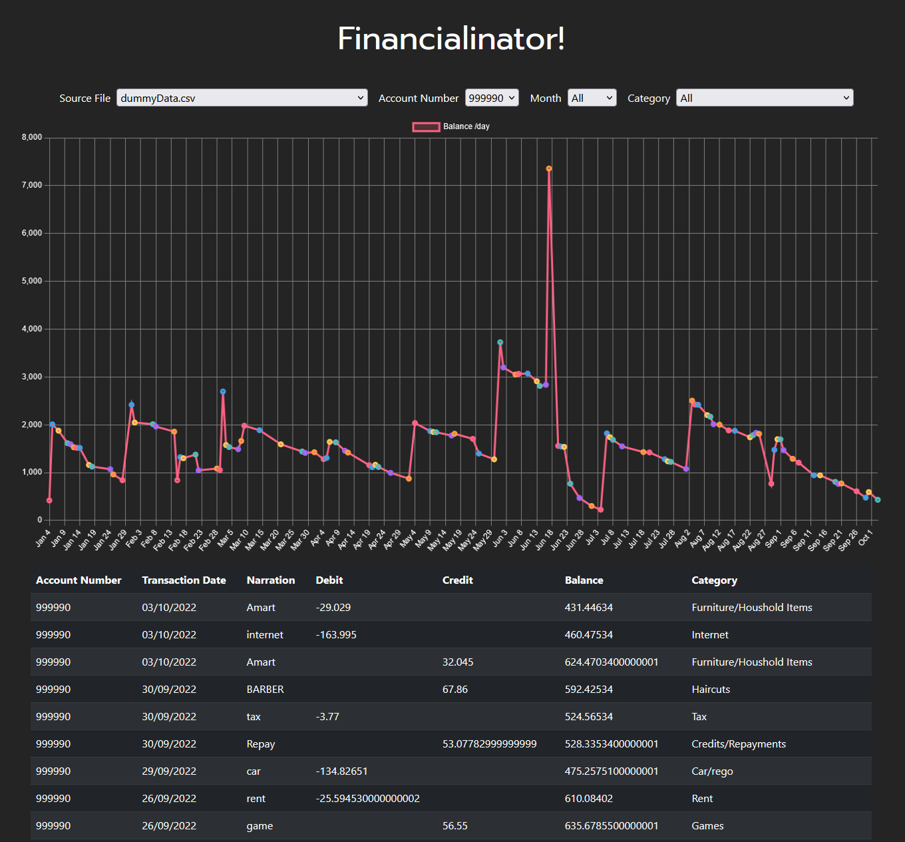

# Financialinator!

This application helps to categorize bank statements, exported as CSV files from most bank websites.

I'm planning to add UI functionality to change and edit bank formats and categories. 
This will likely be converted into a React app to allow for easier hosting and use.

Steps to use current version. Some coding knowledge advised:

1. Export bank transaction history as CSV from your banking website.
2. Put the CSV file into the "Source CSV files" directory.
3. Define a formate for how your CSV file is formatted by editing the "bankFormats.js" file located in the "public" folder.
4. Edit server.js and "public/scripts.js" to import your desired bank format
5. Edit "categories.js" to include keywords from your transactions.
